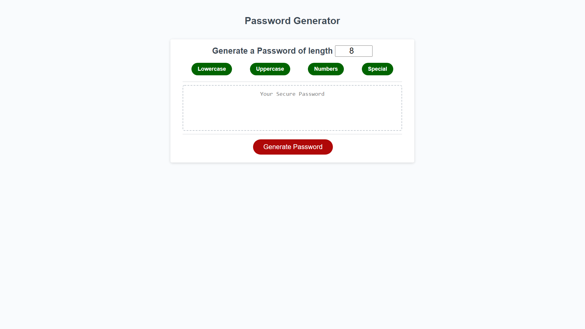

# Random Password Generator

## Description 

In this miniProject I use Javascript to generate a random password that is displayed on an element. The script also add functionality for buttons that allow the user to select criteria for their password such as if they wanted uppercase or no uppercase letters. The buttons also turn red or green depending on whether the criteria are active. There is also an input element where you can specify the length of the password the user wants. The js uses the math library to choose random numbers, and just picks a random index within an array of ascii codes in order to choose a random character.

## Links

Website: https://benw10-1.github.io/first_portfolio/
Repo: https://github.com/benw10-1/first_portfolio

## Screenshots 

